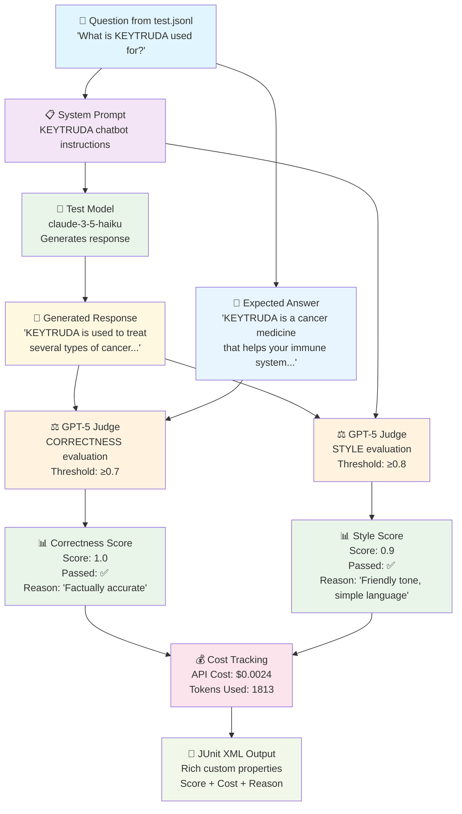

# 🤖 LLM-as-a-Judge Evaluation System

## 🧠 How LLM-as-a-Judge Works

### 📋 Technical Executive Summary

**Dataset**: 27 medical questions about KEYTRUDA drug in `test.jsonl`
- ✅ **Medical questions**: "What is KEYTRUDA used for?", "Is KEYTRUDA safe during pregnancy?"
- ✅ **Off-topic questions**: "Can you help with my headache?" (should be redirected)
- ✅ **Expected answers**: Precise, friendly, with doctor consultation reminders

**System Prompt**: KEYTRUDA chatbot instructions in `system_prompt.txt`
- 🎯 **KEYTRUDA-only information** - redirect off-topic questions
- 🗣️ **Communication style**: Simple language, friendly tone, conciseness
- ⚠️ **Safety**: Doctor consultation reminders, honest but reassuring side effect info

### 🔄 LLM-as-a-Judge Evaluation Flow (Single Test Case)



### 🎯 What Does GPT-5 Judge Evaluate?

**CORRECTNESS (Threshold: 0.7)**
- ✅ **Factual accuracy** of medical information
- ✅ **Response completeness** addressing the question
- ✅ **Safety information** inclusion (side effects, contraindications)
- ✅ **Off-topic handling** (proper redirection to KEYTRUDA)

```python
metric = GEval(
    name="Correctness",
    criteria="""
    Evaluate if the generated answer correctly addresses the user's question
    compared to the expected answer. Consider:
    1. Factual accuracy of medical information
    2. Completeness of the response
    3. Whether key safety information is included
    4. Proper handling of off-topic questions (redirecting to KEYTRUDA)
    """,
    evaluation_params=[
        LLMTestCaseParams.INPUT,
        LLMTestCaseParams.ACTUAL_OUTPUT,
        LLMTestCaseParams.EXPECTED_OUTPUT
    ],
    threshold=0.7,
    model="gpt-5"
)
```

**STYLE (Threshold: 0.8)**
- 🗣️ **Simple language** - avoiding medical jargon
- 😊 **Friendly, patient tone** - supportive for patients
- 📝 **Conciseness and clarity** of structure
- 👨‍⚕️ **Doctor consultation reminders**

```python
metric = GEval(
    name="Style",
    criteria="""
    Evaluate if the response follows KEYTRUDA chatbot style guidelines:
    1. Uses simple, everyday language (avoids medical jargon)
    2. Maintains friendly, patient, and supportive tone
    3. Keeps responses concise and clear
    4. Is honest but reassuring when discussing side effects
    5. Always reminds users to consult their doctor
    6. Stays within scope of provided information
    """,
    evaluation_params=[
        LLMTestCaseParams.ACTUAL_OUTPUT,
        LLMTestCaseParams.CONTEXT  # System prompt as context
    ],
    threshold=0.8,
    model="gpt-5"
)
```

### 📈 Output

For each test we get:
- **Score**: 0.0-1.0 (did it pass the threshold?)
- **Cost**: Real API cost (e.g., $0.0024)
- **Reason**: Detailed GPT-5 evaluation justification
- **Status**: ✅ PASSED / ❌ FAILED

---

Production-ready **LLM evaluation system** using **DeepEval + pytest** with native **JUnit XML output** for CI/CD integration.

## 🎯 Features

- **3 Models Evaluation**: gpt-5-mini, claude-3-5-haiku, gpt-4o-mini
- **GPT-5 as Judge**: State-of-the-art evaluation with detailed reasoning
- **Dual Metrics**: Correctness (≥0.7) + Style (≥0.8) evaluation
- **Real Cost Tracking**: Actual API costs (no estimates!)
- **Rich JUnit XML**: Scores, costs, reasoning, generated responses
- **GitHub Actions**: Automated CI/CD with PR comments and reports

## 🚀 Quick Start

### 1. Setup Environment
```bash
# Create virtual environment
python3 -m venv venv
source venv/bin/activate  # macOS/Linux

# Install dependencies
pip install -r requirements.txt

# Configure API keys
cp .env.example .env
# Edit .env with your OpenAI and Anthropic API keys
```

### 2. Run Evaluation
```bash
# Single test (cost: ~$0.50)
python -m pytest test_llm_evaluation.py -k "test_case0 and test_correctness and claude" -v

# Three test cases (cost: ~$2)
python -m pytest test_llm_evaluation.py -k "(test_case0 or test_case1 or test_case2) and test_correctness" -v

# Full evaluation (cost: ~$10-20)
python -m pytest test_llm_evaluation.py --junitxml=results.xml -v
```

## 📊 Sample Results

```xml
<property name="model" value="claude-3-5-haiku-20241022" />
<property name="correctness_score" value="1.0" />
<property name="correctness_threshold" value="0.7" />
<property name="api_cost_usd" value="$0.0024" />
<property name="tokens_used" value="1813" />
<property name="correctness_reason" value="✅ Evaluation passed" />
```

## 🔧 GitHub Actions Setup

### 1. Add Repository Secrets

Go to **Settings → Secrets and variables → Actions** and add:

```
OPENAI_API_KEY=sk-proj-your-key-here
ANTHROPIC_API_KEY=sk-ant-api03-your-key-here
```

### 2. Trigger Evaluation

**Automatic**: Push to `main`/`develop` or create PR

**Manual**: Go to **Actions → LLM Evaluation → Run workflow**
- Choose scope: `single` (safe/cheap) or `full` (expensive)

### 3. View Results

- **GitHub Actions**: Live progress and summary
- **PR Comments**: Automatic results posted to PRs
- **Artifacts**: Download HTML reports and JUnit XML
- **Test Results**: Native GitHub test reporting

## 📁 Project Structure

```
├── test_llm_evaluation.py     # Main evaluation tests
├── conftest.py               # Pytest configuration for JUnit XML
├── system_prompt.txt         # KEYTRUDA chatbot prompt
├── test.jsonl               # 27 test questions and expected answers
├── .env                     # API keys (create from .env.example)
├── requirements.txt         # Python dependencies
└── .github/workflows/       # GitHub Actions CI/CD
    └── llm-evaluation.yml
```

## 💰 Cost Management

| Scope | Tests | Est. Cost | Use Case |
|-------|-------|-----------|----------|
| Single | 1 test | ~$0.50 | Quick verification |
| Three Cases | 3 tests | ~$2 | Development |
| Full Suite | 162 tests | ~$10-20 | Production validation |

**Cost tracking**: All runs show exact API costs in JUnit XML properties.

## 🎯 Evaluation Metrics

### Correctness (Threshold: 0.7)
- Factual accuracy of medical information
- Completeness of response
- Safety information inclusion
- Proper off-topic question handling

### Style (Threshold: 0.8)
- Simple, everyday language (no medical jargon)
- Friendly, patient, supportive tone
- Concise and clear structure
- Doctor consultation reminders

## 🔍 Example Test Output

```bash
test_llm_evaluation.py::TestLLMQuality::test_correctness[test_case0-0.3-claude-3-5-haiku-20241022] PASSED

Properties:
- model: claude-3-5-haiku-20241022
- correctness_score: 1.0 (threshold: 0.7) ✅
- api_cost_usd: $0.0024
- tokens_used: 1813
- judge_model: gpt-5
```

## 🚨 CI/CD Integration

The system automatically:
1. **Runs on PR**: Evaluates changes with single test (safe)
2. **Posts comments**: Results directly in PR discussions
3. **Uploads artifacts**: HTML reports and JUnit XML
4. **Fails on regressions**: Stops broken evaluations
5. **Tracks costs**: Prevents budget overruns

## 🛠️ Development

```bash
# Run single test for development
python -m pytest test_llm_evaluation.py -k "test_case0" -v

# Run with cost control
python -m pytest test_llm_evaluation.py -x --maxfail=3

# Generate only JUnit XML
python -m pytest test_llm_evaluation.py --junitxml=results.xml
```


## 📚 Based on DeepEval Framework

This implementation follows the **input.md blueprint** using:
- **DeepEval 3.4.9+**: Native G-Eval metrics with GPT-5 judge
- **pytest parametrization**: 3 models × 1 temperature × 27 questions × 2 metrics = 162 tests
- **Async API calls**: Efficient concurrent evaluation
- **JUnit XML integration**: Rich custom properties for CI/CD

---

**🎉 Ready for production LLM evaluation at scale!**