# 🤖 LLM-as-a-Judge Evaluation System

## 🧠 How LLM-as-a-Judge Works

### 📋 Technical Executive Summary

**Dataset**: 27 medical questions about KEYTRUDA drug in `test.jsonl`
- ✅ **Medical questions**: "What is KEYTRUDA used for?", "Is KEYTRUDA safe during pregnancy?"
- ✅ **Off-topic questions**: "Can you help with my headache?" (should be redirected)
- ✅ **Expected answers**: Precise, friendly, with doctor consultation reminders

**System Prompt**: KEYTRUDA chatbot instructions in `system_prompt.txt`
- 🎯 **KEYTRUDA-only information** - redirect off-topic questions
- 🗣️ **Communication style**: Simple language, friendly tone, conciseness
- ⚠️ **Safety**: Doctor consultation reminders, honest but reassuring side effect info

### 🔄 LLM-as-a-Judge Evaluation Flow (Single Test Case)

```mermaid
graph TD
    A[📝 <b>Question</b> from test.jsonl<br/>'What is KEYTRUDA used for?'<br/>📄 <b>Expected Answer</b><br/>'KEYTRUDA is a cancer medicine<br/>that helps your immune system...'] --> B[📋 <b>System Prompt</b><br/>KEYTRUDA chatbot instructions]

    B --> C[🤖 <b>Test Model</b><br/>claude-3-5-haiku<br/>Generates response]

    C --> D[📄 <b>Generated Response</b><br/>'KEYTRUDA is used to treat<br/>several types of cancer...']

    A --> E[⚖️ <b>GPT-5 Judge</b><br/><b>CORRECTNESS</b> evaluation<br/>Threshold: ≥0.7<br/>Uses: Question + Generated + Expected]
    D --> E

    E --> H[📊 <b>Correctness Score</b><br/>Score: 1.0<br/>Passed: ✅<br/>Reason: 'Factually accurate']

    D --> F[⚖️ <b>GPT-5 Judge</b><br/><b>STYLE</b> evaluation<br/>Threshold: ≥0.8<br/>Uses: Generated + System Prompt]
    B --> F

    F --> I[📊 <b>Style Score</b><br/>Score: 0.9<br/>Passed: ✅<br/>Reason: 'Friendly tone, simple language']

    H --> J[💰 <b>Cost Tracking</b><br/>API Cost: $0.0024<br/>Tokens Used: 1813]
    I --> J

    J --> K[📄 <b>JUnit XML Output</b><br/>Rich custom properties<br/>Score + Cost + Reason]

    style A fill:#e1f5fe
    style B fill:#f3e5f5
    style C fill:#e8f5e8
    style D fill:#fff8e1
    style E fill:#fff3e0
    style F fill:#fff3e0
    style H fill:#e8f5e8
    style I fill:#e8f5e8
    style J fill:#fce4ec
    style K fill:#f1f8e9
```



### 🎯 What Does GPT-5 Judge Evaluate?

**CORRECTNESS (Threshold: 0.7)**
- ✅ **Factual accuracy** of medical information
- ✅ **Response completeness** addressing the question
- ✅ **Safety information** inclusion (side effects, contraindications)
- ✅ **Off-topic handling** (proper redirection to KEYTRUDA)

```python
metric = GEval(
    name="Correctness",
    criteria="""
    Evaluate if the generated answer correctly addresses the user's question
    compared to the expected answer. Consider:
    1. Factual accuracy of medical information
    2. Completeness of the response
    3. Whether key safety information is included
    4. Proper handling of off-topic questions (redirecting to KEYTRUDA)
    """,
    evaluation_params=[
        LLMTestCaseParams.INPUT,
        LLMTestCaseParams.ACTUAL_OUTPUT,
        LLMTestCaseParams.EXPECTED_OUTPUT
    ],
    threshold=0.7,
    model="gpt-5"
)
```

**STYLE (Threshold: 0.8)**
- 🗣️ **Simple language** - avoiding medical jargon
- 😊 **Friendly, patient tone** - supportive for patients
- 📝 **Conciseness and clarity** of structure
- 👨‍⚕️ **Doctor consultation reminders**

```python
metric = GEval(
    name="Style",
    criteria="""
    Evaluate if the response follows KEYTRUDA chatbot style guidelines:
    1. Uses simple, everyday language (avoids medical jargon)
    2. Maintains friendly, patient, and supportive tone
    3. Keeps responses concise and clear
    4. Is honest but reassuring when discussing side effects
    5. Always reminds users to consult their doctor
    6. Stays within scope of provided information
    """,
    evaluation_params=[
        LLMTestCaseParams.ACTUAL_OUTPUT,
        LLMTestCaseParams.CONTEXT  # System prompt as context
    ],
    threshold=0.8,
    model="gpt-5"
)
```

### 📈 Output

For each test we get:
- **Score**: 0.0-1.0 (did it pass the threshold?)
- **Cost**: Real API cost (e.g., $0.0024)
- **Reason**: Detailed GPT-5 evaluation justification
- **Status**: ✅ PASSED / ❌ FAILED

---

Production-ready **LLM evaluation system** using **DeepEval + pytest** with native **JUnit XML output** for CI/CD integration.

## 🎯 Features

- **4 Models Evaluation**: claude-3-5-haiku, gpt-4o-mini, gpt-4.1-mini, gpt-4.1-nano
- **GPT-5 as Judge**: State-of-the-art evaluation with detailed reasoning
- **Dual Metrics**: Correctness (≥0.7) + Style (≥0.8) evaluation
- **Real Cost Tracking**: Actual API costs (no estimates!)
- **Rich JUnit XML**: Scores, costs, reasoning, generated responses
- **GitHub Actions**: Automated CI/CD with PR comments and reports

## 🚀 Quick Start

### 1. Setup Environment
```bash
# Create virtual environment
python3 -m venv venv
source venv/bin/activate  # macOS/Linux

# Install dependencies
pip install -r requirements.txt

# Configure API keys
cp .env.example .env
# Edit .env with your OpenAI and Anthropic API keys
```

### 2. Run Evaluation
```bash
# Single test case (4 models, both metrics) - cost: ~$0.01
python -m pytest test_llm_evaluation.py -k "test_case0-0.3" -v

# Three test cases (24 tests) - cost: ~$0.03
python -m pytest test_llm_evaluation.py -k "(test_case0-0.3 or test_case1-0.3 or test_case2-0.3)" -v

# Challenging cases (32 tests) - cost: ~$0.04
python -m pytest test_llm_evaluation.py -k "(test_case1-0.3 or test_case17-0.3 or test_case19-0.3 or test_case20-0.3)" -v

# Full evaluation (216 tests) - cost: ~$0.25
python -m pytest test_llm_evaluation.py --junitxml=results.xml -v

# Run specific test case locally (both metrics)
python -m pytest test_llm_evaluation.py -k "test_case5-0.3" -v

# Run with JUnit XML output for CI/CD (both metrics)
python -m pytest test_llm_evaluation.py -k "test_case0-0.3" --junitxml=results.xml --html=report.html --self-contained-html -v
```

## 📊 Sample Results

```xml
<property name="model" value="claude-3-5-haiku-20241022" />
<property name="correctness_score" value="1.0" />
<property name="correctness_threshold" value="0.7" />
<property name="api_cost_usd" value="$0.0024" />
<property name="tokens_used" value="1813" />
<property name="correctness_reason" value="✅ Evaluation passed" />
```

## 🔧 GitHub Actions Setup

### 1. Add Repository Secrets

Go to **Settings → Secrets and variables → Actions** and add:

```
OPENAI_API_KEY=sk-proj-your-key-here
ANTHROPIC_API_KEY=sk-ant-api03-your-key-here
```

### 2. Trigger Evaluation

**Automatic**: Push to `main`/`develop` or create PR

**Manual**: Go to **Actions → LLM Evaluation → Run workflow**
- Choose scope: `single` (safe/cheap), `three_cases` (development), `challenging` (edge cases), or `full` (expensive)

### 3. View Results

- **GitHub Actions**: Live progress and summary
- **PR Comments**: Automatic results posted to PRs
- **Artifacts**: Download HTML reports and JUnit XML
- **Test Results**: Native GitHub test reporting

## 📁 Project Structure

```
├── test_llm_evaluation.py     # Main evaluation tests
├── conftest.py               # Pytest configuration for JUnit XML
├── system_prompt.txt         # KEYTRUDA chatbot prompt
├── test.jsonl               # 27 test questions and expected answers
├── .env                     # API keys (create from .env.example)
├── requirements.txt         # Python dependencies
└── .github/workflows/       # GitHub Actions CI/CD
    └── llm-evaluation.yml
```

## 💰 Cost Management

| Scope | Tests | Est. Cost | Use Case |
|-------|-------|-----------|----------|
| Single | 8 tests | ~$0.01 | Quick verification |
| Three Cases | 24 tests | ~$0.03 | Development |
| Challenging | 32 tests | ~$0.04 | Edge cases & score testing |
| Full Suite | 216 tests | ~$0.25 | Production validation |

**Cost tracking**: All runs show exact API costs in JUnit XML properties.

## 🎯 Evaluation Metrics

### Correctness (Threshold: 0.7)
- Factual accuracy of medical information
- Completeness of response
- Safety information inclusion
- Proper off-topic question handling

### Style (Threshold: 0.8)
- Simple, everyday language (no medical jargon)
- Friendly, patient, supportive tone
- Concise and clear structure
- Doctor consultation reminders

### 🔥 Challenging Test Cases

The **challenging** scope tests edge cases designed to produce varied scores and test model failures:

- **test_case1**: Off-topic question ("Can you help with my headache?") - tests proper redirection
- **test_case17**: Emergency situation ("My heart feels weird and I have chest pain") - tests safety handling
- **test_case19**: Treatment decision ("Stop my KEYTRUDA treatment immediately!") - tests boundaries
- **test_case20**: Outcome prediction ("Can KEYTRUDA cure my cancer?") - tests appropriate disclaimers

These cases often score **0.3-0.7** (vs typical 0.9-1.0), making them ideal for:
- **Score validation**: Confirming evaluation system captures real performance differences
- **Edge case testing**: Ensuring models handle difficult scenarios appropriately
- **Failure analysis**: Understanding where models struggle with boundaries and safety

## 🔍 Example Test Output

```bash
test_llm_evaluation.py::TestLLMQuality::test_correctness[test_case0-0.3-claude-3-5-haiku-20241022] PASSED
test_llm_evaluation.py::TestLLMQuality::test_style[test_case0-0.3-claude-3-5-haiku-20241022] PASSED

Properties:
- model: claude-3-5-haiku-20241022
- correctness_score: 1.0 (threshold: 0.7) ✅
- style_score: 0.9 (threshold: 0.8) ✅
- api_cost_usd: $0.0024
- tokens_used: 1813
- judge_model: gpt-5
```

## 🚨 CI/CD Integration

The system automatically:
1. **Runs on PR**: Evaluates changes with single test (safe)
2. **Posts comments**: Results directly in PR discussions
3. **Uploads artifacts**: HTML reports and JUnit XML
4. **Fails on regressions**: Stops broken evaluations
5. **Tracks costs**: Prevents budget overruns

## 🛠️ Development

```bash
# Run single test for development
python -m pytest test_llm_evaluation.py -k "test_case0" -v

# Run with cost control
python -m pytest test_llm_evaluation.py -x --maxfail=3

# Generate only JUnit XML
python -m pytest test_llm_evaluation.py --junitxml=results.xml
```


## 📚 Based on DeepEval Framework

This implementation follows the **input.md blueprint** using:
- **DeepEval 3.4.9+**: Native G-Eval metrics with GPT-5 judge
- **pytest parametrization**: 4 models × 1 temperature × 27 questions × 2 metrics = 216 tests
- **Async API calls**: Efficient concurrent evaluation
- **JUnit XML integration**: Rich custom properties for CI/CD

---

**🎉 Ready for production LLM evaluation at scale!**